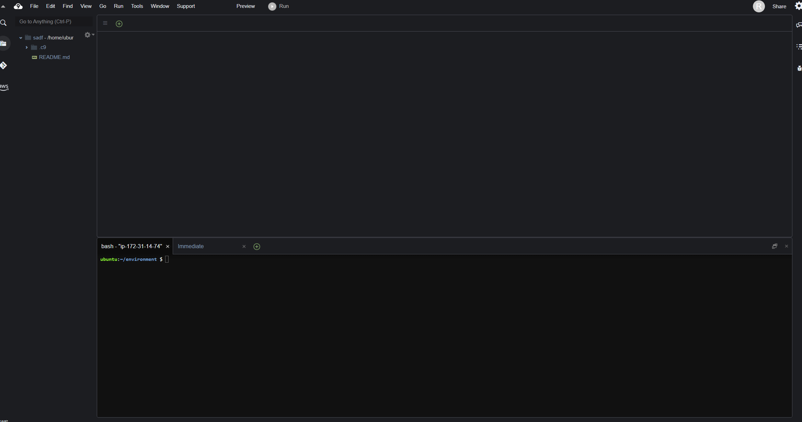
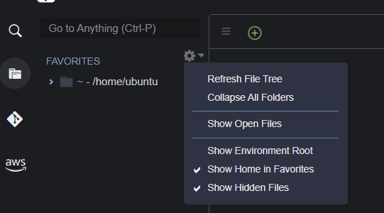

### 마무리

1. 추천번호 뽑아내기
2.  배포

<hr>

## DEPLOY


## AWS Cloud9 Deploy

하나라도 잘못 될 경우 배포가 정상적으로 이루어지지 않을 수 있으니 차근차근 따라합니다.

#### AWS: https://aws.amazon.com/

- AWS에 가입하기
- 콘솔에 로그인해 Cloud9 검색하여 진입
- Create environment
  - Name, Description
  - Platform: Ubuntu
  - Cost-saving setting: 서버 목적에 따라(상시: never)

아래와 같은 Cloud9 화면이 등장합니다.




Cloud9의 환경이 정상적으로 생성됐다면, 다시 AWS 콘솔로 가서 EC2 항목으로 접속합니다.
네트워크 및 보안 - 보안 그룹으로 접속하여 만든 서버로 들어가서 인바운드 규칙 편집 버튼을 누릅니다.


- 8000- 0.0.0.0/0, ::/0
- 80- 0.0.0.0/0, ::/0
  총 네가지 규칙을 추가하고 저장


## Cloud9 터미널에서 진행

1. EC2

2. git 설치(기본 버전 설치되어 있음, 생략 가능)

   ```bash
   #설치
   $sudo apt-get install git
   $sudo apt install git
   
   #버전 체크
   $git --version
   ```

   

   

3. Python 설치하기

   ```bash
   # pyenv 설치
   $git clone https://github.com/pyenv/pyenv.git ~/.pyenv
   
   #bash 설정
   $echo 'export PYENV_ROOT="$HOME/.pyenv"' >> ~/.profile
   $echo 'export PATH="$PYENV_ROOT/bin:$PATH"' >> ~/.profile
   $echo 'eval "$(pyenv init --path)"' >> ~/.profile
   $echo -e 'if command -v pyenv 1>/dev/null 2>&1; then\n  eval "$(pyenv init -)"\nfi' >> ~/.bashrc
   ```

   
   
4. 터미널 재시작하여 pyenv 설치 확인

   ````bash
   $pyenv -v
   ````

   설치되지 않았을 경우 1번부터 다시 진행

   
   
5. Python 설치

   ```bash
   $pyenv install 3.9.7
   $pyenv global 3.9.7
   $python -V
   ```

   되도록 로컬 환경과 같은 버전의 파이썬을 설치하며 global 선언을 하지 않으면 2.x 버전이 등장합니다.
   Python 설치 과정이 오래 걸릴 수 있습니다.

   
   
6. Cloud9 보기 설정을 아래와 같이 변경
   

   
   
7. 경로 이동

   ```bash
   $cd ~
   ```

   ~ 경로는 해당 환경에서 홈 디렉토리를 의미합니다.

   

8. git clone

   ```bash
   $git clone {project_remote_url}
   ```

   >```bash
   ># 로그인 정보 저장
   >$git config credential.helper store
   >```

   

   <hr>

   ### 여기서 잠깐!

   아래에서 사용할 {루트 폴더}는 프로젝트(Repository) 이름, {프로젝트 폴더}는 Django 프로젝트명입니다.

   편의를 위해서 두 경로의 이름을 같게 하는 것이 좋습니다.

   <hr>

9. 루트 폴더로 이동

   ```bash
   $cd ~/{루트 폴더}
   ```

   
   
10. 가상환경 생성 및 실행

   ```bash
   $python -m venv {가상 환경 이름}
   
   # 명령어가 source로 다릅니다.
   $source {가상 환경 이름}/bin/activate
   ```

   


11. 기본 작업

    ```bash
    # 라이브러리 설치
    $pip install -r requirements.txt
    # 마이그레이션
    $python manage.py migrate
    # 수퍼유저 설정
    $python manage.py createsuperuser
    # fixture가 있는 경우
    $python manage.py loaddata {data.json}
    ```

    

12. collectstatic

    Django는 static파일을 동적으로 관리하지만, 배포 환경에서는 클라이언트와 직접 상호작용하는
    NginX라는 서버가 static파일을 관리할 수 있도록 static파일을 모아줍니다.


    setting.py에 STATIC_ROOT설정
    
    ```python
    # settings.py
    import os
    STATIC_ROOT = os.path.join(BASE_DIR, 'staticfiles')
    ```
    
    staticfiles폴더에 static 파일 모으기
    
    ```bash
    $python manage.py collectstatic
    ```


​    

13. Django 실행 확인

    ```bash
    $python manage.py runserver
    ```


### gunicorn

1. gunicorn 설치하기

   ```bash
   pip install gunicorn
   ```

   

2. 서버 실행하기

   ```bash
   $gunicorn --bind 0.0.0.0:8000 {프로젝트 폴더}.wsgi:application
   ```

   해당 기능을 실행하고 터미널에 http://0.0.0.0:8000을 실행하면 DisallowedHost 에러가 등장해야 합니다.
   
3. Host 추가

   ```python
   #settings.py
   ALLOWED_HOSTS = ['차단된 IP 주소']
   ```

   수정 후, 서버를 재시작합니다.

   

   <hr>

   ### 여기서 잠깐!

   아래서 vim 명령어를 사용하게 됩니다.

   간단하게 i 키를 눌러 입력모드로 전환, ESC키를 눌러 모드 종료, :wq 를 입력하여 저장 후 종료만 알면 됩니다.

   <hr>

4. gunicorn 설정

   ```bash
   $sudo vi /etc/systemd/system/gunicorn.service
   ```

   위 명령어를 입력하고 아래 코드를 수정하여 각자 환경에 맞게 입력하고 종료합니다.

   ````bash
   [Unit]
   Description=gunicorn daemon
   After=network.target
   
   [Service]
   User=ubuntu
   Group=www-data
   WorkingDirectory=/home/ubuntu/{루트 폴더}
   ExecStart=/home/ubuntu/{루트 폴더}/venv/bin/gunicorn \
           --workers 3 \
           --bind 127.0.0.1:8000 \
           {프로젝트 폴더}.wsgi:application
   
   [Install]
   WantedBy=multi-user.target
   ````

   

5. 시스템 데몬 재시작

   ```bash
   sudo systemctl daemon-reload
   ```

   

6. 서비스 실행 및 등록

   ```shell
   sudo systemctl start gunicorn
   sudo systemctl enable gunicorn
   ```

   실행 상태 확인

   ```bash
   sudo systemctl status gunicorn.service
   ```

   오류가 뜬다면 내용을 잘 읽고 틀린 사항을 찾아내야 합니다.

   

   

### NginX

1. nginx 설치

   ```bash
   $sudo apt-get update
   $sudo apt-get install -y nginx
   ```

2. 파일 수정

   ```bash
   $sudo vi /etc/nginx/sites-available/django_test
   ```

   

   ```bash
   server {
   		listen 80;
   		server_name {서버 IP 주소 입력};
   		
   		location /static/ {
   				root /home/ubuntu/{루트 폴더}/staticfiles/;
   		}
   		
   		location / {
   				include proxy_params;
   				proxy_pass http://127.0.0.1:8000;
   		}
   }
   ```

   

3. 심볼릭 링크 설정

   ```shell
   sudo ln -s /etc/nginx/sites-available/django_test /etc/nginx/sites-enabled
   ```

   > 혹시라도 잘못 입력했다면 아래와 같이 입력하여 제거한다.
   >
   > ```shell
   > sudo rm -f /etc/nginx/sites-enabled/{잘못 지정한 이름}
   > ```

   

4. nginx 재시작

   ```shell
   sudo systemctl restart nginx
   systemctl status nginx.service
   ```

   만약 80번 포트가 사용중이라면

   ```shell
   sudo lsof -t -i tcp:80 -s tcp:listen | sudo xargs kill
   ```

   명령어 실행 후 다시 재시작
   
5. 퍼블릭 IP로 접속해보기


## DNS

### Route53

- 도메인 구입 후 진행 가능
  

1. 레코드 생성: 레코드 유형 - A, 값 - EC2 퍼블릭 IP
   
2. nginx 설정 수정

   ```bash
   $sudo vi /etc/nginx/sites-available/django_test
   ```

   ```bash
   server {
   		listen 80;
   		server_name {서버 IP 주소} {도메인};
   		
   		location /static/ {
   				root /home/ubuntu/{루트 폴더}/staticfiles/;
   		}
   		
   		location / {
   				include proxy_params;
   				proxy_pass http://127.0.0.1:8000;
   		}
   }
   ```


   nginx, gunicorn 재시작

   ```bash
   # nginx
   $sudo systemctl restart nginx
   # gunicorn
   $sudo systemctl restart gunicorn
   ```

> 상태 확인
>
> ```bash
> $systemctl status nginx.service
> $sudo systemctl status gunicorn.service
> ```
>
> 

3. setting.py 수정

   ```python
   #settings.py
   ALLOWED_HOSTS = ['퍼블릭 IP', '도메인']
   ```

   수정 후, 서버를 재시작합니다.

도메인에 접속합니다.


### HTTPS 인증

#### certbot

1. core 설치(기본 설치, 생략 가능)


   ```bash
   $sudo snap install core; sudo snap refresh core
   ```

   


2. certbot 설치

   ```bash
   $sudo snap install --classic certbot
   ```

   
   
3. 심볼릭 링크

   ```bash
   $sudo ln -s/snap/bin/certbot /usr/bin/certbot
   ```

   
   
4. 자동 설정

   ```bash
   sudo certbot --nginx
   ```

   

   이메일 입력창이 뜨면 이메일을 입력하고, 동의 창이 뜨면 Y를 눌러 동의합니다.
   도메인 선택은 기본적으로 하나만 뜨기 때문에 1을 입력하면 처리됩니다.

#### EC2

EC2보안그룹 인바운드 규칙에 포트범위 443, 0.0.0.0/0, ::/0 두 규칙을 추가합니다.
